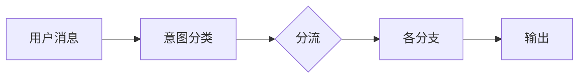

# 2026-06-29

## 今天做了什么
在本地部署ollama Qwen3.6本地模型,部署Dify并且熟悉各项功能。搭起对话系统的第一版骨架，定了两个地基性的选择。

## 关键选择：Chatflow 而不是 Workflow
Dify 有两种项目类型。Workflow 每次调用都是独立的，不记上下文；Chatflow 自带对话记忆。客服场景用户很少一句话说完，得接多轮，所以选 Chatflow。它还自带会话编号（conversation_id），不同用户各有各的会话，记忆不会串，省掉了自己写隔离的活。

这里想清楚一点：客服 Agent 最要紧的是接得住多轮对话，答得全反而次要。编排平台这个地基选对，后面才有得谈。

## 搭了主干
用户消息 → 意图分类（大模型判断这句想干嘛）→ 按意图分流处理 → 汇总输出。能跑通。第一天最费劲的是理清节点之间的连线和变量传递，尤其是分支的输出怎么汇到一起。

## 前端自己写
没用 Dify 自带的嵌入界面，自己写了个聊天页面直连它的对话接口。会话编号由前端保管、每次请求带上，这样每开一个浏览器标签就是一个独立会话。

## 今日小结图

最朴素的骨架：分类 → 分流 → 输出。后面所有复杂度都长在这条主干上。

## 状态
骨架通了；确定业务方向做银行客服。
