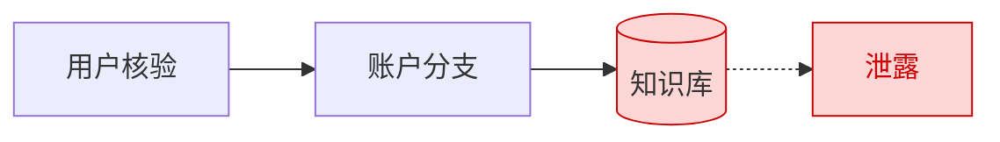

# 2026-06-30

## 今天做了什么
把系统落成银行客服的样子，然后撞上了整个项目最严重的一个问题。

## 隐私泄露事故（今天的重点）
测身份核验时，我故意把卡号后四位填错，结果大模型的回复里把系统里的**正确卡号**说出来了。

排查过程走了弯路：一开始以为是提示词不够严，反复加"禁止透露卡号"，没用。后来才想明白问题的真正位置——

我把客户档案放进了知识库。知识库用 RAG：按语义相似度检索资料块，连同问题一起喂给大模型。按姓名一检索，返回的是那位客户的**整条记录**，正确卡号就摆在大模型眼前了。你让它别说，它只是"大概率"照做，只要答案在它视野里，就永远有漏的风险。提示词治标不治本。

更根本的：RAG 靠"语义相似"找东西，但卡号没有语义，`1234` 和 `1233` 在机器看来差不多。用相似度做精确匹配，本来就用错了工具。

**得出的原则**：数据分两类，处理方式必须分开——
- 精确类（卡号、金额、状态）：精确查询，且绝不让大模型看到原始数据。
- 模糊类（产品、流程）：RAG 正合适。

混在一起就是这次泄露的根。明天的核心任务：把它们拆开。

## 其他进展
- 导入了导师给的转账未到账标注语料，写脚本清洗成结构化数据，作为后面虚拟数据和测试用例的来源。
- 身份核验先做了个表单版（弹窗一次填三样），够用，也作为后面"自然语言收集"失败时的兜底。
- 修了个意图分类的毛病：本来"感谢""闲聊"都会命中同一句写死的问候语，取消了这个死板分类，社交类输入统一交给大模型灵活应答。

## 今日小结图
问题的样子——客户档案和产品手册一起进了知识库，检索出的整条记录喂给模型，卡号就漏了：

## 状态
方向已定，明天做数据面重构。
