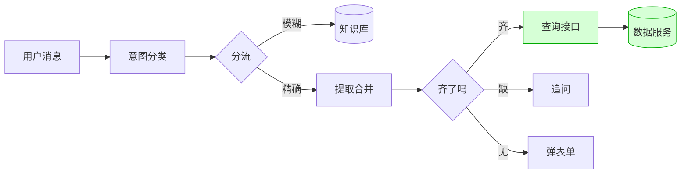

# 2026-07-01

## 今天做了什么
把敏感数据搬出大模型的视野，并让核验能"听懂人话"。这是把昨天想明白的原则真正落地的一天。

## 数据面改造：从"喂给模型"到"查接口"
起了个独立小服务（bank_api.py），读 Excel 里的客户和转账数据，对外只提供两个查询接口：核验接口返回"通过/不通过+状态"，转账接口返回"这笔的状态"。**只返回结论，不返回原始数据**。

Dify 这边改用 HTTP 节点去调它。这样大模型全程只看到"核验通过，已锁定"这种结论，根本不知道正确卡号是什么，想泄露也没得泄露——风险从"靠提示词祈祷"变成"架构上不可能"。

这么改还带来两个好处：改 Excel 就等于更新数据；以后换银行真接口，Dify 那张图不用动。

## 核验升级：从填表到对话
表单版太生硬。真实用户会说"我卡锁了，我叫张三，尾号1234"，一句里给了俩信息还差一个。系统得能一点点抠、缺啥问啥。

用 Dify 的参数提取器抽字段，碰到两个坑：
- **它不记事**：这轮抽的名字下轮就丢，开记忆也没用。解法是自己拿"会话变量"当收集篮子，每轮做"新抽的+已存的"合并再存回去。
- **光数字抓不准**：乱序无标签的"1234"时抽时漏。加正则兜底——先摘走11位手机号，剩下的4位才当卡号。代码规则确定，不像模型会飘。

集齐程度决定走向：三样齐了就查接口报结果；缺一两样就追问缺的；一样没有就先安抚再弹表单。

两个后知后觉的细节：核验完要清空篮子（不然串到下一个用户）；弹表单靠固定节点拼一个标记触发，不让模型自己输出（不能靠它"记得"）。

## 路由承接
Dify 每条消息都重新分类一次。多轮收集时，用户回一句"6630"孤立看没有意图特征，容易被扔错分支。给分类器加了记忆和承接规则："上一轮在问转账信息，这轮回啥都算转账"。

## 顺手解决的时区坑
转账要理解"昨天"。但模型没有时钟，服务器时钟还是格林尼治时间，让它自己算把"昨天"算成了两年前。改成入口用代码算出北京时间的今天，注入给模型，换算规则写死。

## 今日小结图
改造后的样子——精确数据走接口只回结论，模糊知识才走知识库；核验支持分轮收集：

## 状态
核验、转账两条链路走通；开始搭批量测试工具。
