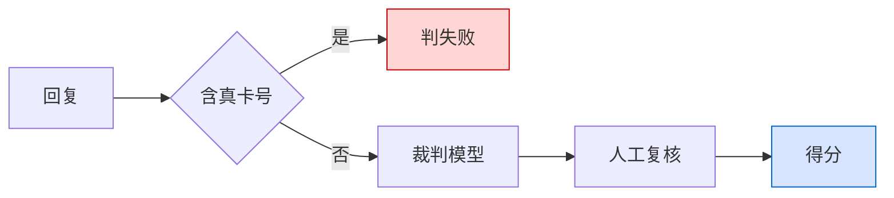

# 2026-07-02

## 今天做了什么
把测试从"手工一条条点"变成"批量自动跑"，并整理仓库准备开源。

## 测评怎么从死板变靠谱
功能一多，手工测跟不上，得自动化。走了两版：

**第一版关键词判分**：给每条用例定"回复里该出现哪个词"。立刻翻车——客服把"退汇处理中"说成"正在办理退汇"，意思全对，但没出现那个词就判失败。对话说法太活，卡字面行不通。

**第二版让大模型当裁判**（LLM-as-Judge）：给每条用例写"标准答案"（描述该达成什么目的），让裁判模型对比标准答案和实际回复，只看意思对不对，不管措辞。

但裁判也不能全信，做成三层：
1. 安全红线用代码硬判——防泄露的用例只要出现真实卡号直接判死，不交给另一个模型去"觉得"。
2. 常规用例交裁判模型，解决字面死板。
3. 留人工复核，能一键覆盖机器判定，最终分按人工算。模型解决"量"，人工解决"准"。

排错插曲：一开始"大模型判分和关键词效果一样"，查出来是判分的密钥没配、悄悄退回了关键词。教训是**降级必须显示出来**——我把"这条是谁判的（模型/关键词）"透出来，才发现在用错的那个。

做成了网页控制台：批量跑、看正确率、筛失败项、导出。测试从体力活变成工具。

## 顺手补的 Agent 问题
- 空槽位分支原来是干巴巴一句静态回复，情绪化的用户得不到安抚——前面加了个共情节点，先安抚再引导。
- 知识边界分两种对待：问写诗写代码这种（域外）硬拒绝；问一个不存在的理财产品（域内但没收录）则委婉致歉+引导，不能套用硬拒绝的话术，更不能编。之前这俩混着处理，效果都不好。

## 整理开源
- 密钥全换成占位符/环境变量；写死的绝对路径改成相对路径，换台机器也能跑。
- 目录归拢成 frontend / server / testing / data / scripts / docs。
- 第三方语料不进仓库。
- 脱敏后重建了 git 历史——敏感内容留在旧提交里是删不干净的，只在工作区删不够。

## 今日小结图
判分的三层裁定——安全红线代码硬判，常规交裁判模型，再留人工复核：

## 状态
测评工具可用；仓库整理好了。
