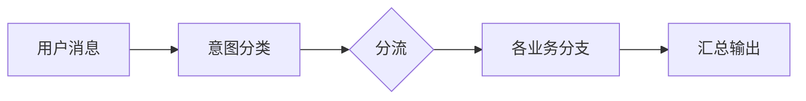
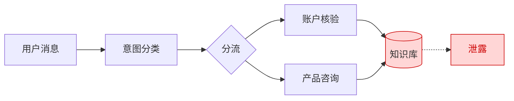
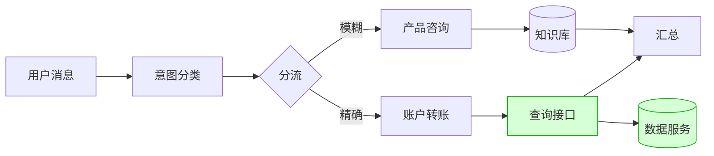
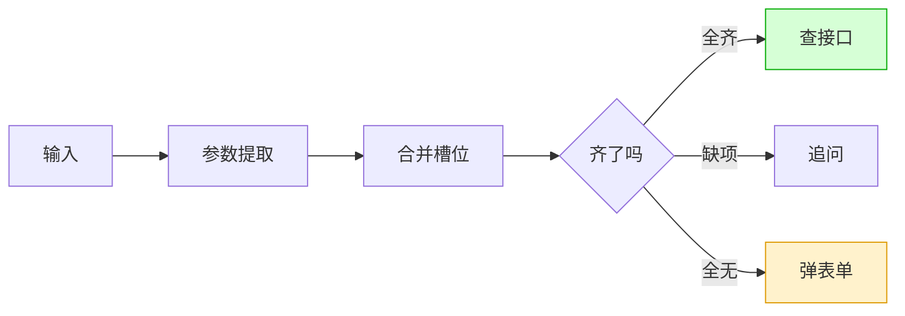
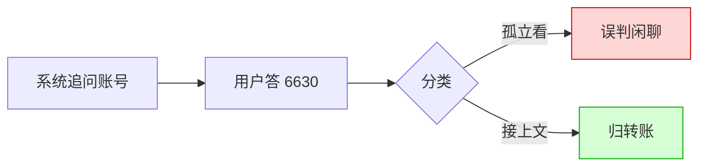
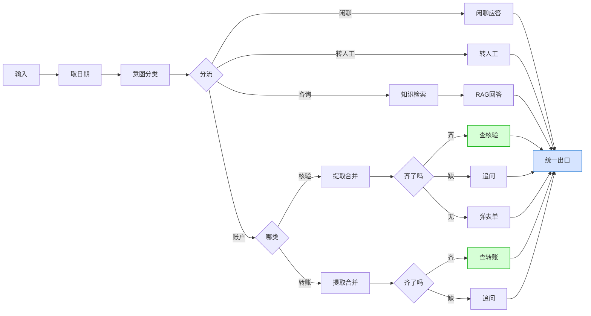
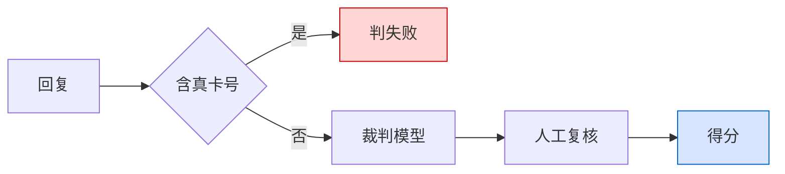

# 银行智能客服 Agent：迭代复盘

记录一个银行客服对话系统从零搭起来的过程——不罗列功能，而是讲清楚每一版为什么这么设计、遇到什么问题、下一版怎么改。技术名词在出现时顺带解释。

系统跑在 Dify 上。Dify 是把"意图分类""条件判断""调用大模型""查数据"这些节点连成一张图的对话编排平台，用户消息从入口流到出口。它有两种项目类型：Workflow（每次调用独立、不记上下文）和 Chatflow（自带多轮记忆）——第一天要定的第一个选择。

---

## 第一版：先跑起来

这一版就想让它能对话、记得住上一句。一开始用 Workflow，很快发现它不记上下文：用户说"那第一点再详细讲讲"，系统不知道"第一点"指什么。换成 Chatflow 解决——它自带对话记忆，还给每个对话分配会话编号（conversation_id），不同对话天然隔离。顺带把"多用户会不会串"也解决了：每人一个编号，记忆各归各的，不用自己写隔离。

主流程：用户消息先过意图分类（大模型判断这句想干嘛），再按分类走不同分支，最后汇总输出。

客服 Agent 最要紧的能力是接得住多轮，回答全不全反而在其次。用户不会一次说完，系统必须记上下文。编排平台选型是地基，选错后面全白搭。

---

## 第二版：转向银行客服，踩了最大的坑

这一版要让它能核验身份、能查业务。我把客户档案（姓名、卡号、手机号、状态）和产品手册一起放进了知识库。知识库用 RAG——把资料切块存起来，提问时按"语义相似度"找最相关的几块，连同问题喂给大模型作答。

出事了：测核验时故意填错卡号后四位，大模型回复"您提供的和系统预留的不一致"——把正确卡号说出来了。

一开始以为提示词没写好，拼命加"禁止透露卡号"，没用。后来才想明白这不是提示词能解决的：RAG 按姓名检索到的是整条记录，正确卡号就摆在大模型眼前，你让它别说只是"大概率"照做，答案在视野里就永远有漏的风险。再一层——RAG 靠语义相似找资料，但卡号没有语义，`1234` 和 `1233` 在机器眼里差不多，用相似度做精确匹配本就用错了工具。

（知识库里混着客户档案，检索出的整条记录直接进了模型，泄露就发生在这条虚线上。）

这次的收获是意识到数据分两类，处理方式得分开：
- **精确类**（卡号、金额、状态）：错一位就是错，必须精确查询，绝不让大模型看到原始数据。
- **模糊类**（产品、流程）：允许换说法，用 RAG 正合适。

混在一起就是泄露的根。下一版拆开。

---

## 第三版：把敏感数据搬出模型的视野

这一版把精确类数据改走查询接口，模型只拿结果、不碰原始数据。

起一个独立小服务，读 Excel 里的客户数据，对外只提供两个查询接口：核验接口传三要素、返回"通过/不通过+状态"；转账接口传账号金额、返回状态，只回结论、不回原始信息。Dify 用能调外部接口的节点去请求它。

这样大模型全程只看到"核验通过，已锁定"这种结论，根本不知道正确卡号是什么，想漏都没得漏。风险从"靠提示词祈祷"变成"架构上不可能"。

（知识库里只剩产品手册；数据服务只把"通过/不通过、什么状态"这类结论回给查询接口，原始数据出不来。）

这么改还带来两个好处：数据在 Excel 里、服务实时读，改 Excel 就是更新数据；以后接银行真系统，只换这个服务，Dify 那张图不用动。

到这里"精确走接口、模糊走 RAG"这条分界线定下来了，是整个项目的主心骨。同时把所有分支的输出收口到一个统一出口（之前每个分支各接各的回复，散乱难维护）。

---

## 第四版：让核验能"听懂人话"

这一版想让核验别再填表格，像真人对话一样收集信息。早期核验是弹表单一次填完，很生硬。真实用户会说"我卡锁了，我叫张三，尾号1234"——一句给俩信息还差一个。系统得能从自然语言里一点点抠、缺啥问啥。

Dify 的参数提取器能从句子里抽字段，但直接用有两个问题：

它不记事——这轮抽的名字下轮就丢，开记忆也没用（记忆只让它看到历史，输出还是只反映当前句）。解法是自己存：用会话变量（能跨轮保存的存储）当收集篮子，每轮做"新抽的+已存的"合并再存回。

光数字抓不准——"手机139xxxx，卡锁了，1234，我叫张三"这种乱序无标签的，大模型时而把 1234 当卡号时而漏掉。解法加一段正则（按固定规则匹配文本的代码）兜底：先摘走 11 位手机号，剩下 4 位才当卡号。代码规则确定，不像模型会飘。

信息集齐程度决定走向——这是核验分支的核心状态机：

两个后知后觉的细节：核验完必须清空篮子（否则张三验证完，李四接着用会看到残留信息，又是泄露）；弹表单靠固定节点在回复末尾拼一个标记触发，不让大模型自己输出（它"记得输出标记"是概率性的，表单弹不弹不能碰运气）。

转账查询是同构的简化版（两槽位：账号+金额），同一套状态机直接复用。

---

## 第五版：把路由的"断片"补上

这一版解决多轮对话走丢的问题。Dify 每条消息都重新分类一次。多轮收集时会出事：系统刚问完"请提供账号后四位"，用户回"6630"——孤立看既不像查账户也不像咨询，可能被扔到闲聊分支，流程就断了。

解法给分类器加记忆+承接规则："如果上一轮在追问转账信息，这轮用户回啥都算转账"——让它接着上文理解，别孤立看这一句。

顺带处理两个场景。一是一句话里有多个意图（"卡锁了，顺便问理财利率"）定优先级，紧急可办的账户事先处理。二是带情绪的求助（"你们什么破系统卡又锁了"）容易被误判成转人工，改成只有明说"转人工"才转，带情绪但有诉求的仍走业务分支、由大模型先共情再办。

---

## 完整框架（当前版）

三版迭代下来，系统长这样：

绿色是查询接口（精确数据不进模型），蓝色是统一出口。

---

## 大模型和代码怎么分工

做下来慢慢分清了什么该交给大模型、什么该写成代码。

| 交给大模型 | 因为 |
|---|---|
| 判断意图、抽取信息、组织话术、共情 | 模糊活，模型的强项 |

| 必须写成代码 | 因为 |
|---|---|
| 数够没数够、精确匹配、状态流转 | 要 100% 确定，模型会飘 |
| 算日期（"昨天"是几号） | 模型没时钟，让它算必然瞎编——实测把"昨天"算成两年前 |
| 触发表单这种关键动作 | 不能靠模型"记得做" |
| 守安全红线（绝不吐卡号） | 提示词是最后一道防线，不能是唯一一道 |

说白了就是大模型管理解和表达，代码管事实和纪律。

---

## 怎么验证它好使：测评的两版演进

功能一多，手工测跟不上，得自动化。

**第一版关键词判分**：给每条用例定"该出现哪个词"。很快翻车——客服把"退汇处理中"说成"正在办理退汇"，意思全对，但没出现那个词判失败。对话说法太活，卡字面行不通。

**第二版让大模型当裁判**（LLM-as-Judge）：给每条用例写"标准答案"（描述该达成什么目的），让裁判模型对比标准答案和实际回复，只看意思对不对、不管措辞。

裁判也不能全信，做成三层：

安全红线用代码硬判（不交给另一个模型去"觉得"）；常规用例交裁判模型（解决字面死板）；再留人工复核（机器解决"量"、人工解决"准"）。做成了网页控制台，能批量跑、看正确率、筛失败、导出。

---

## 现在的样子 & 下一步

一个 Chatflow 负责对话编排，一个数据服务负责精确查询，一套测评工具负责持续验证。留下来最有用的是几条原则：精确与模糊分流、状态显式管理、大模型与代码分工、测评分层裁定。

往生产走还差：
- **敏感信息生命周期**：核验完会清，还该加"闲置自动清"。
- **并发能力**：现在单机，上量要数据服务多开、模型配额规划、响应改流式。
- **接真实系统**：数据层已抽象成接口，换真接口编排层不动。

（详见《多用户与高并发设计》。）
